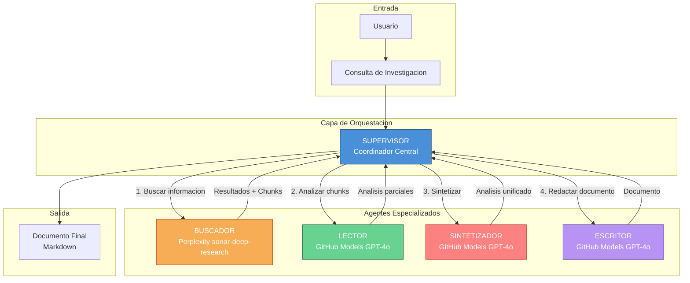
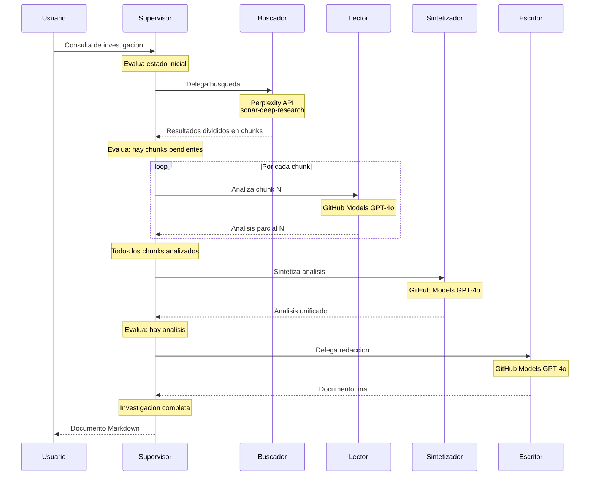
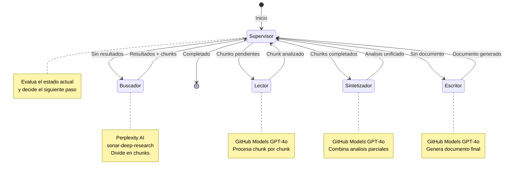

# DokiResearch

<p align="center">
  
</p>

<p align="center">
  <strong>Sistema multi-agente de investigacion automatizada</strong><br/>
  Implementado con LangGraph + LangChain.js + GitHub Models + Perplexity AI
</p>

<p align="center">
  <a href="https://github.com/Yonsn76/DokiResearch"></a>
  
  
  
  
</p>

---

## Descripcion General

Sistema **multi-agente** donde cada agente es una entidad independiente con su propio LLM.

A diferencia de un agente unico con multiples herramientas, este sistema implementa **agentes especializados** que colaboran bajo la coordinacion de un **Supervisor**.

---

## Arquitectura del Sistema



---

## Flujo de Ejecucion Detallado



---

## Grafo de Estados (StateGraph)



---

## Comparativa de Arquitecturas

| Caracteristica | Agente Unico | Multi-Agente |
|----------------|--------------|--------------|
| Modelos LLM | 1 LLM compartido | Multiples LLMs independientes |
| Especializacion | Generalista | Agentes especializados |
| Delegacion | Sin delegacion | Supervisor coordina |
| Contexto | Compartido | Aislado por agente |
| Escalabilidad | Limitada | Alta |
| Mantenimiento | Complejo | Modular |

---

## Stack Tecnologico

| Componente | Tecnologia | Proposito |
|------------|------------|-----------|
| Orquestacion | LangGraph | Grafo de estados para coordinacion |
| Framework | LangChain.js | Base para agentes y herramientas |
| LLM Busqueda | Perplexity sonar-deep-research | Busquedas en tiempo real |
| LLM Analisis | GitHub Models GPT-4o | Procesamiento y redaccion |
| Validacion | Zod | Schemas de herramientas |
| CLI | Chalk, Figures, Boxen | Interfaz profesional |

---

## Configuracion

### Variables de Entorno

Crear archivo `.env` en la raiz del proyecto:

```env
# GitHub Models API
GITHUB_TOKEN=tu_github_token_aqui
MODEL_NAME=gpt-4o

# Perplexity API (Agente Buscador)
PERPLEXITY_API_KEY=tu_perplexity_api_key_aqui
```

### Obtencion de Credenciales

| Servicio | URL |
|----------|-----|
| GitHub Token | https://github.com/settings/tokens |
| Perplexity API | https://www.perplexity.ai/settings/api |

---

## Instalacion

```bash
# Clonar el repositorio
git clone https://github.com/Yonsn76/DokiResearch.git
cd DokiResearch

# Instalar dependencias
npm install

# Configurar variables de entorno
cp .env.example .env
# Editar .env con tus credenciales
```

---

## Uso

### Modo Chat Conversacional (Recomendado)

```bash
# Iniciar chat interactivo con el Supervisor LLM
npm run chat
```

En este modo puedes:
- **Conversar** naturalmente con DokiResearch
- **Pedir investigaciones** cuando lo necesites
- **Continuar la conversación** después de cada investigación
- **Revisar historial** de investigaciones completadas

**Comandos del chat:**
| Comando | Descripcion |
|---------|-------------|
| `/help` | Mostrar ayuda |
| `/clear` | Limpiar historial de conversacion |
| `/reset` | Reiniciar completamente |
| `/history` | Ver investigaciones completadas |
| `/exit` | Salir del chat |

**Ejemplos de conversacion:**
```
> Hola, ¿que puedes hacer?
> Investiga sobre inteligencia artificial en 2024
> ¿Que encontraste sobre el tema?
> Profundiza en machine learning
> Gracias, ahora investiga sobre cambio climatico
```

### Modo Directo (Una sola investigacion)

```bash
# Ejecutar investigacion directa
npm run dev "Tu consulta de investigacion"

# Ejemplos
npm run dev "Analisis del mercado de IA en 2024"
npm run dev "Tendencias en desarrollo de software"
npm run dev "Impacto economico del cambio climatico"
```

---

## Estructura del Proyecto

```
research-multi-agent/
├── src/
│   ├── index.ts                 # CLI modo directo
│   ├── chat.ts                  # CLI modo conversacional
│   ├── server.ts                # API server (opcional)
│   ├── supervisor/
│   │   └── supervisor-agent.ts  # Supervisor LLM conversacional
│   ├── agents/
│   │   └── worker-agents.ts     # Agentes especializados
│   ├── graph/
│   │   └── research-graph.ts    # StateGraph LangGraph
│   └── llm/
│       ├── github-models.ts     # Cliente GitHub Models
│       └── perplexity.ts        # Cliente Perplexity
├── .env                         # Variables de entorno
├── package.json
└── tsconfig.json
```

---

## Patrones Implementados

1. **Conversational Supervisor** - Supervisor LLM que puede conversar y asignar tareas
2. **Supervisor Pattern** - Agente central que coordina el flujo de investigacion
3. **Worker Agents** - Agentes especializados independientes
4. **StateGraph** - Grafo de estados para orquestacion
5. **Chunking** - Division de resultados grandes para evitar limites de tokens
6. **Tool Isolation** - Herramientas aisladas por agente
7. **Conversation Memory** - Memoria de conversacion y investigaciones previas

